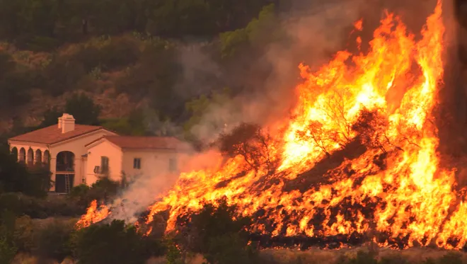

# The 2017 Thomas Fire
### Visualizing the effects on land and air



Image credit: [usatoday.com](https://www.usatoday.com/story/news/2017/12/26/californias-largest-recorded-wildfire-winding-down-firefighters-gain-upper-hand/982571001/)

## About
The Thomas Fire was a large and destructive wildfire that occurred in Southern California in December 2017. It scorched over 280,000 acres, becoming one of the largest wildfires in California's history. The fire caused significant damage to local environments, infrastructure, and homes, led to the evacuation of thousands, and resulted in the loss of lives. This repository holds notebooks that aim to explore the results of this fire in Santa Barbara and Ventura County. The notebooks uses geospatial data of the fire perimeter, Landsat data to better visualize the fire scar, and Air Quality Index(AQI) data to demonstrate the effect it had on the air in the surrounding area.


This reposirtory housese three notebooks. The `thomas-fire-aqi.ipynb` notebook examines air quality changes before, during, and after the fire. The `thomas-fire-false-color.ipynb` notebook explores different methods of visualization of the geographic extent of the fire. Notebook `thomas_fire_analysis.ipynb` combines both of the previous two analysses into one polished workflow for the purpose of a blog post.

## Highlights

- Data wrangling and exploration with `pandas` and `rioxarray`
- Geospatial data wrangling with `geopandas` and `rioxarray`
- CRS conversions between tabular and xarray datasets
- Saving the resulting subset to a local daat folder using `to_file()`
- Using `plot()` to visualize true color plots of the fire
- Creating and customizing a false color map using `matplotlib.pyplot`


## Data
The data for these analyses is housed in this repository, except for the unfiltered California fire perimeter shapefile. The AQI, Landsat, and California state fire data were downloaded from the sources listed below then used locally. 

## Acknowledgments & References

All materials were created by [Carmen Galaz-Garcia](https://github.com/carmengg) for [EDS-220: Working with Environmental Data](https://meds-eds-220.github.io/MEDS-eds-220-course/).

1. U.S. Geological Survey. (n.d.). *Landsat 8-9 OLI/TIRS collection 2 level-2 science products | USGS EROS Archive*. U.S. Geological Survey. https://www.usgs.gov/centers/eros/science/usgs-eros-archive-landsat-archives-landsat-8-9-olitirs-collection-2-level-2 Access date: November 19, 2024.

2. Data.gov. (2024). *California fire perimeters (ALL)*. Data.gov. https://catalog.data.gov/dataset/california-fire-perimeters-all-b3436 Access date: November 19, 2024.

3. Airnow.gov. (2017-2018).  *US Environmental Protection Agency.* [Air Quality Index (AQI)](https://www.airnow.gov/aqi/aqi-basics/) data from the [US Environmental Protection Agency](https://www.epa.gov)  Access date: October 26, 2024.

## Repository Organization

 ```
 eds220-hwk4-repo                
├── data/
│    ├── thomas_fire/
│    │   ├── thomas_fire.shp # Thomas fire perimeter data
│    │   ├── thomas_fire.cpg
│    │   ├── thomas_fire.dbf
│    │   ├── thomas_fire.prj
│    │   └── thomas_fire.shx
│    ├── daily_aqi_by_county_2017.csv # 2017 AQI data
│    ├── daily_aqi_by_county_2018.csv # 2018 AQI data
│    └──landsat8-2018-01-26-sb-simplified.nc # Landsat data
├── images/                       
│   └──2017_thomas_fire_2.jpeg  # Image for README
├── .gitignore   
├── README.md    
├── thomas-fire-aqi.ipynb  # Jupyter notebook for fire AQI data 
├── thomas-fire-false-color.ipynb # Jupyter notebook for fire perimeter visualization    
└── thomas-fire-analysis.ipynb # Jupyter notebook for complete analysis    
``` 
